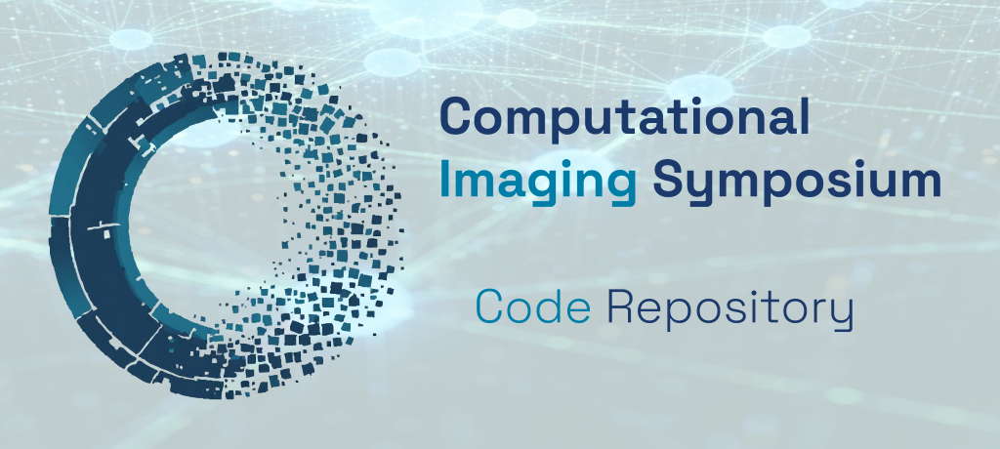

    
A curated collection of open-source code, tools, and repositories for computational imaging research — covering tomographic reconstruction, inverse problems, and imaging systems.

---

## All Computational Imaging Projects

| Project | Description | Language | License |
|---|---|---|---|
| [MBIRJAX](repos/mbirjax) | Model-Based Iterative Reconstruction using JAX for tomographic data | Python | BSD-3 |

---

## Getting Started

Browse the projects above or use the **search bar** (top of page) to find specific algorithms, methods, or topics. Each project page includes installation instructions, usage examples, and links to full documentation.
